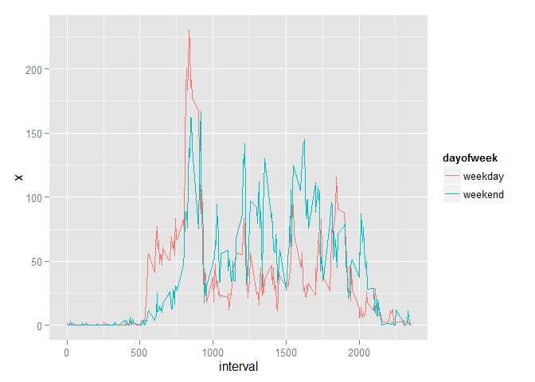

# Reproducible Research: Peer Assessment 1

## Loading and preprocessing the data
Source data downloaded on 1/11/2016 from [Coursera Data Science Specialization - Reproducible Research course website][1]
Compressed data was unzipped to reveal CSV file, then loaded into R

```r
d <- read.csv('activity.csv')
```

Process date and interval fields into single datetime

```r
d$datetime <- strptime(paste(d$date,sprintf("%04d",d$interval),sep=" "),"%Y-%m-%d %H%M")
```

## What is mean total number of steps taken per day?
Aggregate the total number of steps per day

```r
totalbyday <- aggregate(d$steps,list(day=d$date),sum)
```

Plot histogram of daily step totals

```r
hist(totalbyday$x, xlab="Total Steps Per Day",main="Histogram of Total Steps Per Day")
```

\

Find the mean and median total number of steps taken per day

```r
mean(totalbyday$x,na.rm=TRUE)
```

```
## [1] 10766.19
```

```r
median(totalbyday$x,na.rm=TRUE)
```

```
## [1] 10765
```

## What is the average daily activity pattern?
Calculate the average number of steps by 5 min interval

```r
# remove empty values from data set
cleand <- na.omit(d)
meanbyint <- aggregate(cleand$steps,list(interval=cleand$interval),mean)
```

Load R plotting libraries

```r
library(ggplot2)
library(scales)
```

Plot mean steps per 5 min interval

```r
p <- ggplot(meanbyint,aes(x=interval,y=x)) + geom_line() + xlab("5 min. Interval") + ylab("Mean number of steps taken") + ggtitle("Mean Number of Steps Taken per 5 min. Interval")
print(p)
```

\

Find the 5 min. interval with the most average steps taken per day

```r
max(meanbyint$x)
```

```
## [1] 206.1698
```

## Imputing missing values
Find the number of missing values in the dataset

```r
sum(is.na(d$steps))
```

```
## [1] 2304
```

Fill in missing values with average for that interval

```r
#filld <- within(d,steps<-ifelse(is.na(steps),meanbyint[meanbyint$interval==interval,2],steps))
filld <- d
for(steps in 1:length(d$steps)){
    if(is.na(d$steps[steps])){
        i <- d$interval[steps]
        filld$steps[steps] <- meanbyint[meanbyint$interval==i,2]
    }
}
```

Plot histogram of average steps by day with estimated values

```r
filldtotal <- aggregate(filld$steps,list(day=filld$date),sum)
hist(filldtotal$x, xlab="Total Steps Per Day (with Estimates)",main="Histogram of Total Steps Per Day (with Estimates)")
```

\

Find mean and median with estimated values

```r
mean(filldtotal$x)
```

```
## [1] 10766.19
```

```r
median(filldtotal$x)
```

```
## [1] 10766.19
```

Mean and median steps are identical to eachother and both are identical to the mean without estimated values

## Are there differences in activity patterns between weekdays and weekends?
First identify which days are weekdays and which are weekends

```r
filld$dayofweek <- ifelse(weekdays(filld$datetime)=="Saturday" | weekdays(filld$datetime)=="Sunday","weekend","weekday")
filld$dayofweek <- as.factor(filld$dayofweek)
```

Plot steps taken per 5 min interval, comparing weekdays to weekends

```r
filldbyday <- aggregate(filld$steps,list(dayofweek=filld$dayofweek,interval=filld$interval),mean)
p <- ggplot(filldbyday,aes(x=interval,y=x,color=dayofweek)) + geom_line()
print(p)
```

\

Weekday activity starts earlier in the day with a peak in the morning while weekend activity starts a bit later and continues into the evening later.

[1]: https://d396qusza40orc.cloudfront.net/repdata%2Fdata%2Factivity.zip
